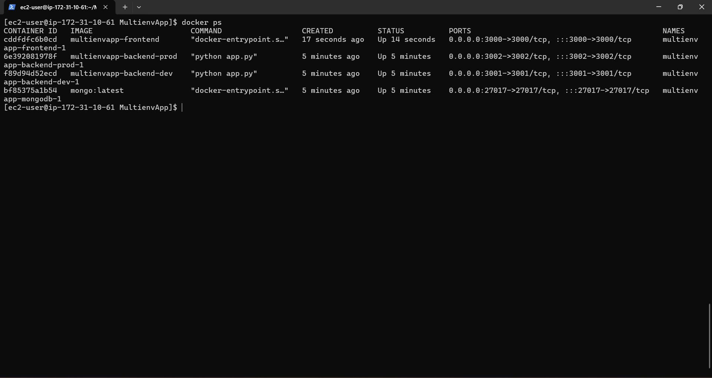
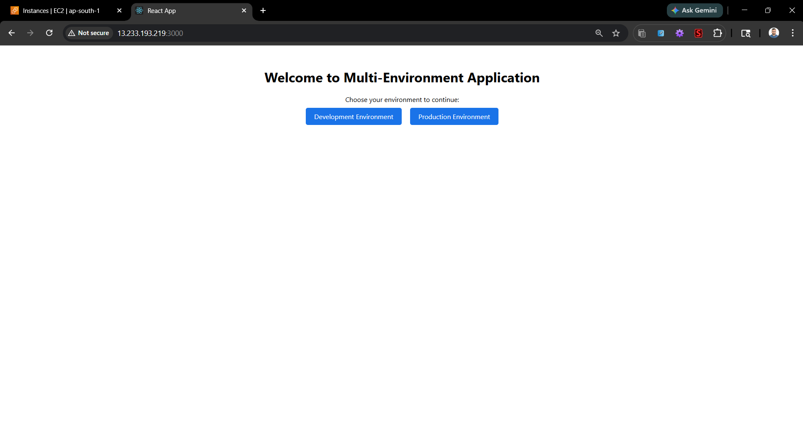
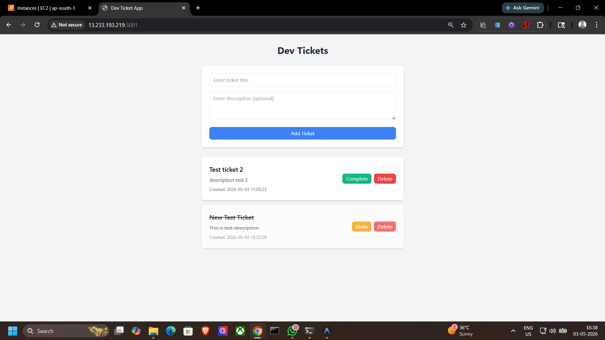
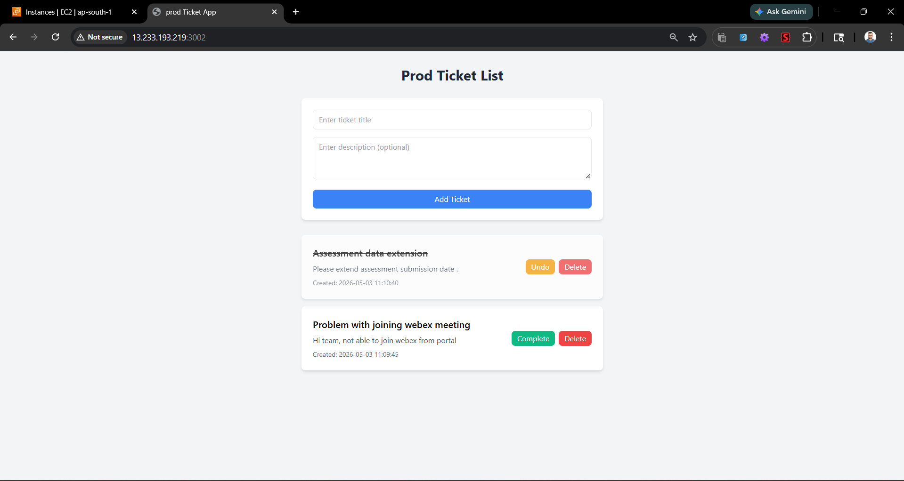
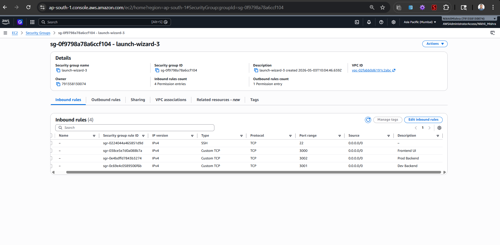

# Multi-Environment Application Deployment

## Quick start instructions
To run this project locally or on a server, execute the following commands:

```bash
# Clone the repository
git clone https://github.com/nik-hil-10/MultienvApp.git
cd MultienvApp

# Build and start the containers in detached mode
docker compose up -d --build

# Verify running containers
docker ps
```

## Prerequisites and dependencies
Ensure your environment meets the following requirements before deploying:
- **Operating System:** Amazon Linux 2023 / Ubuntu / macOS / Windows
- **Docker:** Engine version 24.0+ 
- **Docker Compose:** Version 2.20+ (Buildx plugin required)
- **Network:** Open TCP ports `3000`, `3001`, and `3002`

## Step-by-step deployment guide
1. Launch an **Amazon Linux 2023** EC2 instance and configure the AWS Security Group to allow inbound traffic from `Anywhere (0.0.0.0/0)` on ports 22, 3000, 3001, and 3002.
2. SSH into the instance and install Docker and Docker Compose:
```bash
sudo yum update -y
sudo yum install docker -y
sudo systemctl start docker
sudo systemctl enable docker
sudo usermod -aG docker ec2-user

# Install Docker Compose and Buildx
sudo mkdir -p /usr/local/lib/docker/cli-plugins
sudo curl -SL "https://github.com/docker/compose/releases/latest/download/docker-compose-linux-x86_64" -o /usr/local/lib/docker/cli-plugins/docker-compose
sudo curl -SL "https://github.com/docker/buildx/releases/download/v0.17.1/buildx-v0.17.1.linux-amd64" -o /usr/local/lib/docker/cli-plugins/docker-buildx
sudo chmod +x /usr/local/lib/docker/cli-plugins/docker-compose
sudo chmod +x /usr/local/lib/docker/cli-plugins/docker-buildx
```
3. Clone the repository and navigate into it:
```bash
git clone https://github.com/nik-hil-10/MultienvApp.git
cd MultienvApp
```
4. Create the necessary Docker configurations:
   - **Frontend:** Create a `Dockerfile` in the `frontend/` directory to build the React app.
   - **Backends:** Create a `Dockerfile` in both `backend/dev/` and `backend/prod/` to serve the Flask applications.
   - **Docker Compose:** Create a `docker-compose.yml` file in the root directory to define the `frontend`, `backend-dev`, `backend-prod`, and `mongodb` services, ensuring ports 3000, 3001, and 3002 are properly mapped and environment variables (like `MONGO_URI`) are passed.
5. Execute `docker compose up -d --build` to build images and spin up all containers.
6. Access the services via:
   - Development Environment: `http://13.233.193.219:3000/dev` (Tickets added via `http://13.233.193.219:3001`)
   - Production Environment: `http://13.233.193.219:3000/prod` (Tickets added via `http://13.233.193.219:3002`)
   - Frontend Dashboard: `http://13.233.193.219:3000`

*(**Important Note for Evaluator:** To prevent unexpected AWS billing charges, the EC2 instance has been terminated after capturing the required evidence. Please refer to the "Screenshots and evidence" section below to verify the successful deployment).*

## Troubleshooting section
- **Containers are crashing immediately:** Check the logs using `docker logs <container_name>`. Ensure the `mongodb` service is running successfully before the backends attempt to connect.
- **compose build requires buildx 0.17.0 or later:** The Amazon Linux default Docker installation lacks the required buildx plugin. Follow the deployment guide to manually curl and install `docker-buildx` into `/usr/local/lib/docker/cli-plugins/`.
- **Cannot access URLs in browser:** Verify that the AWS Security Group allows inbound TCP traffic on ports 3000, 3001, and 3002.

## Screenshots and evidence
- **Running Docker Containers:** 
- **Frontend Dashboard:** 
- **Development Environment:** 
- **Production Environment:** 
- **EC2 Security Group Configuration:** 
